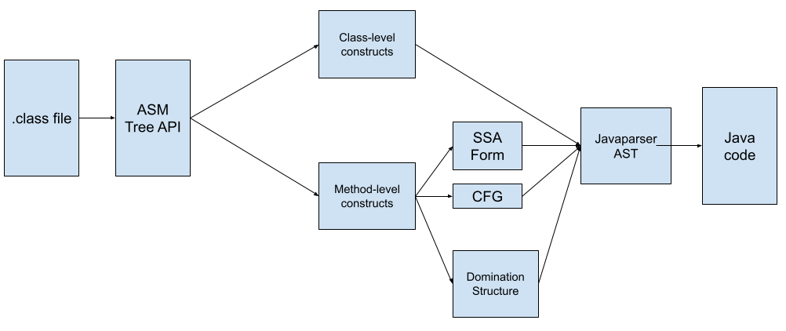

# Developer Guide

This document details the design and implementation of Jade. For documentation of each component or class, refer to the <a href="../../api/index.html">generated API reference</a>.

## Decompilation

At a high level, Jade works as follows:

1. Jade takes a path to a Java `.class` file as its input.
2. Jade reads the raw Java bytecode from the `.class` file using [ASM](https://asm.ow2.io/) via the ASM Tree API.
3. Jade builds a Java abstract syntax tree (AST) using data structures provided by [JavaParser](https://javaparser.org/).
  - Bytecode sections belonging to class-level constructs (fields, method signatures, etc.) are directly translated from bytecode into JavaParser data structures.
  - Bytecode sections belonging to method bodies with instructions are converted into 3 useful intermediate representations: control flow graph (CFG), Static-Single Assignment (SSA) form and CFG Dominator Structure form. Jade utilizes these three representations to construct a Java AST.
- The Java AST is converted into Java code and written to the output stream.

The following figure illustrates Jade's decompiling workflow:

### Subcomponents

Jade's source consists of the following subcomponents:

- `/analysis`: Algorithms for analyzing code.
- `/asm`: Wrappers around ASM library, a library for manipulating JVM bytecode / `.class` file.
- `/classfile`: Code for parsing data from JVM bytecode / `.class` files.
- `/decompile`: Code for decompiling JVM bytecode.
- `/javaparser`: Wrappers around JavaParser library, a library for representing Java ASTs.
- `/jgrapht`: Wrappers around JGraphT library, a library for vertex-edge graphs.
- `/main`: Main command-line entry point.
- `/maven`: Code for downloading and testing againt Maven repositories.
- `/util`: Utility classes.

### Parsing and Decompiling Class-level Constructs
(TODO: High-level implementation strategy & key design decisions)

### Parsing and Decompiling Method Bodies
(TODO: High-level implementation strategy & key design decisions)

### Computation of Control Flow Graph
(TODO: High-level implementation strategy & key design decisions)

### Computation of Domination Structure
(TODO: High-level implementation strategy & key design decisions)

### Computation of Static Single Assignment (SSA) Form
(TODO: High-level implementation strategy & key design decisions)

### Decompilation Flow
(TODO: High-level implementation strategy & key design decisions)

## Testing against bytecodes

### Obtaining test data
Moved under [Testing](../testing/overview.md).

### Class-level constructs
Moved under [Testing](../testing/overview.md).

### Method body
(TODO)
