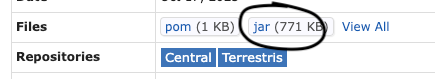
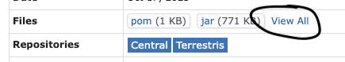
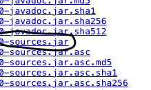

# Testing

## Class-Level Comparison

The correctness of decompiling class-level constructs can be tested by decompiling some bytecode, recompiling it, and comparing the results.
Using an example of bytecode in `Foo.class`, the steps are as follows:

1. Decompile Java file with Jade using the `decompile` command:

```sh
# Make the tmp/ directory if it doesn't already exist
mkdir tmp

jade decompile Foo.class tmp
```

This should decompile `Foo.class` into `Foo.java`, under the `tmp` directory.

2. Recompile the decompiled code

```sh
javac ./tmp/Foo.java -s tmp
```

This will recompile `Foo.java` into `Foo.class`, also under the `tmp` directory.

If there are any dependencies, download the `.jar` files and include them with a `-classpath` parameter; for example:

```sh
javac -classpath ".:bar.jar:baz.jar" Foo.java -s tmp
```

3. Compare the `.class` files

```sh
jade diff Foo.class tmp/Foo.class
```

!!! note
	Alternatively, the `.class` files can also be compared using `javap -p -s` with `diff`:

	```sh
	javap -p -s Foo.class > original.txt
	javap -p -s tmp/Foo.class > recompiled.txt
	diff original.txt recompiled.txt

	# Piped version; No temporary files
	diff <(javap -p -s Foo.class) <(javap -p -s tmp/Foo.class)
	```

## Obtaining test data from Maven

Jade is intended to be tested against the entire catalogue of Maven.

### Manually downloading a Maven repository

- Look for the desired repository from [MVN Repository](https://mvnrepository.com/) and go to the desired version's page.
- To download `.class` bytecodes of a repository, click on "jar (XXX KB)".



- Unzip the `.jar` file (i.e. `unzip <path/to/jar> -d <destination>`). It might be useful to filter out `.class` files recursively using the following Bash script:

```bash
for i in $( find repo_extracted -name "*.class" -type f ); do
	echo $i
	cp $i repo_class_files
done
```

- To download the original source code (in `.java`), click on "View All", then look for the jar file with the suffix `-sources.jar`. You may unzip such jar file and filter out `.java` files and copy them into a separately folder as above.




Useful medium-sized repositories:

- <https://mvnrepository.com/artifact/junit/junit/4.13.2>
- More coming soon!
