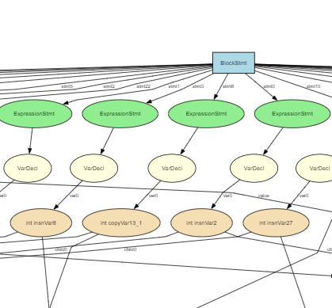

# Playground

The playground provides an interactive environment for testing and experimenting with the Jade decompilation framework. It allows you to run various harnesses on Java input files and visualize the results.

## Getting Started

### 1. Prepare Input Files
Place all Java files you want to process in the `playground/input` directory.

### 2. Run the Playground
Execute the following command from the project root:
```bash
./gradlew playground:run --console=plain
```

> **Note:** The `--console=plain` flag enables cleaner interaction with stdin/stdout.

### 3. Select Harnesses
The playground will present an interactive dialog where you can:
- Type the index number of any harness to toggle its enabled/disabled state
- Press **Enter** to exit the dialog and run all selected harnesses

Each enabled harness will process all input files and generate outputs in the corresponding `playground/output/{harness_key}/` directory.

## Featured Example: DotHarness

The DotHarness demonstrates the power and convenience of the harness system for development workflows. This harness generates Graphviz DOT files for visual representation of decompiled code structures.

### Prerequisites
For optimal visualization, install the [Graphviz Interactive Preview](https://marketplace.visualstudio.com/items?itemName=tintinweb.graphviz-interactive-preview) VS Code extension.

### Visual Output
The DotHarness generates interactive visual representations of the decompiled BlockStmt structures:


You can directly interact with the generated visualizations to explore the code structure:




## Creating Custom Harnesses

You can easily extend the playground by creating custom harnesses to analyze or transform decompiled code in specific ways.

### Step 1: Implement the Harness

Create a new class that extends `PlaygroundHarness`:

```kotlin
class DecompileHarness() : PlaygroundHarness() {
    override val key: String = "decompile"
    override val description: String = "Decompile a method body"

    override fun run(classNode: ClassNode, methodNode: MethodNode) {
        // Process the classNode and methodNode as needed
        
        // Send output to files via "print/println"
        println("Output content here - saved to playground/output/decompile/original_name.txt")

        println("I will saved to that same file too!")

        println("This makes saving content so much easier!")
    }
}
```

**Key Points:**
- The `key` property determines the output directory name
- The `description` appears in the harness selection dialog
- The `run` method receives ASM's `ClassNode` and `MethodNode` for each input file
- Any output to stdout/stderr is automatically saved to `playground/output/{key}/{filename}.txt`

### Step 2: Register the Harness

Add your harness to the registry in `runner/HarnessRegistry.kt`:

```kotlin
object HarnessRegistry {
    private val harnesses: List<PlaygroundHarness> = listOf(
        AnalyzerHarness(),
        DecompileHarness(),
        SSATestHarness(),
        DotHarness(),
        YourCustomHarness(), // Add your harness constructor here
    )
}
```

### Output Structure

For each input file `playground/input/Example.java`, your harness will generate output at:
```
playground/output/{your_harness_key}/Example.txt
```